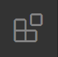

# Install visual studio code

1. Download the installer [here](https://code.visualstudio.com/) and run it. 
2. TODO (follow the installer the standard settings should be ok)
3. click  (the extensions tab)
4. search for [LaTeX Workshop](https://marketplace.visualstudio.com/items?itemName=James-Yu.latex-workshop) and install it.
5. (optionally) search for [LTeX](https://marketplace.visualstudio.com/items?itemName=valentjn.vscode-ltex) and install it. This extension doses the grammar/spelling check.

---

[return to install](../install.md)

[return to getting started without a bibliography manager](../../getting-started.md)