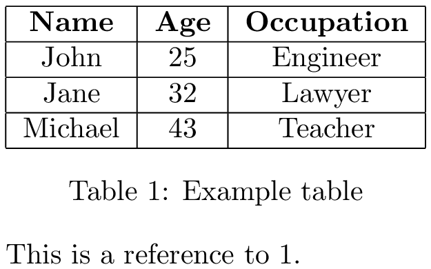
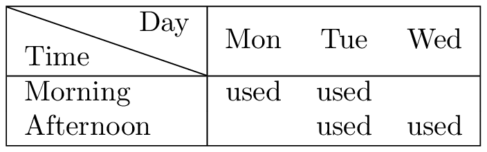

## Basic example

```
\documentclass{article}
\begin{document}
\begin{table}
    \centering
    \begin{tabular}{|c|c|c|}
        \hline
        \textbf{Name} & \textbf{Age} & \textbf{Occupation} \\
        \hline
        John & 25 & Engineer \\
        \hline
        Jane & 32 & Lawyer \\
        \hline
        Michael & 43 & Teacher \\
        \hline
    \end{tabular}
    \caption{Example table}
    \label{tab:example}
\end{table}
This is a reference to \ref{tab:example}.
\end{document}
```

In this example, we create a table with three columns (Name, Age, and Occupation) using the tabular environment. The `c` option in the column specification indicates that each column should be centered, and the `|` characters add vertical lines to the table. The `\hline` commands create horizontal lines to separate the table headers from the table content.

We also include the table environment to allow LaTeX to automatically place the table in the best possible location within the document. Finally, we add a caption and a label. The label allows us to refer to it in the text using the `\ref` command.
<p style="text-align: center;">

</p>
## Making Table Heads with Diagonal Lines
using the package `diagbox`[^1] you can make diagonal lines. This example is from the documentation:
```
\begin{tabular}{|l|ccc|}
\hline
\diagbox{Time}{Day} & Mon & Tue & Wed \\
\hline
Morning & used & used & \\
Afternoon & & used & used \\
\hline
\end{tabular}
```
<p style="text-align: center;">

</p>
---

[^1]: [diagbox Package (v2.3)](https://ftp.mpi-inf.mpg.de/pub/tex/mirror/ftp.dante.de/pub/tex/macros/latex/contrib/diagbox/diagbox.pdf)